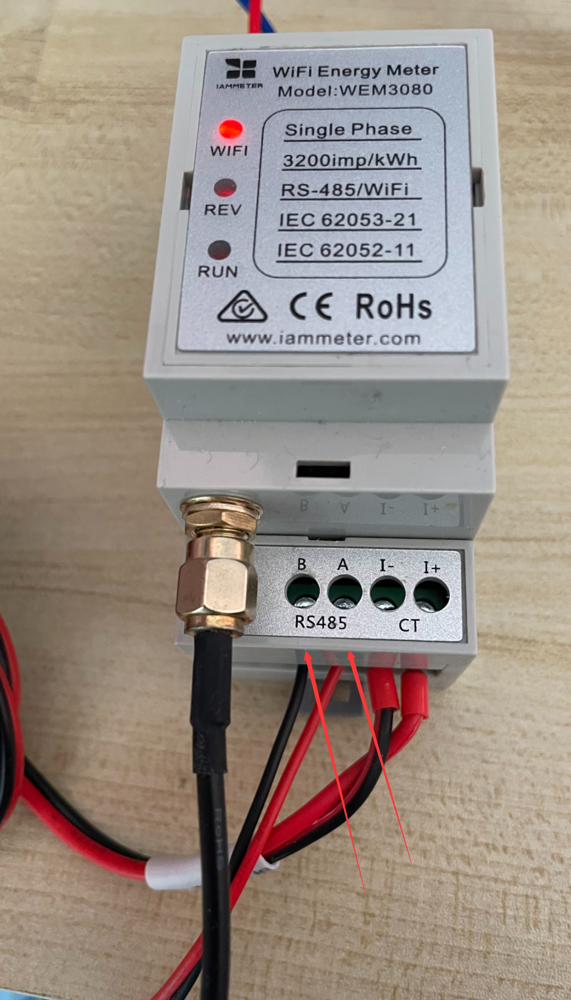
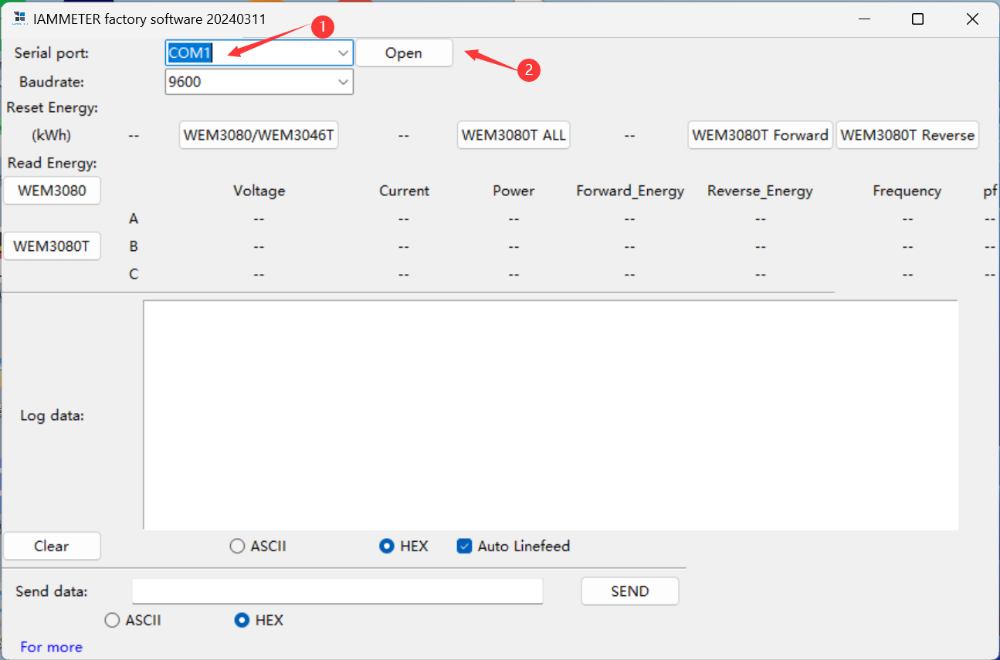
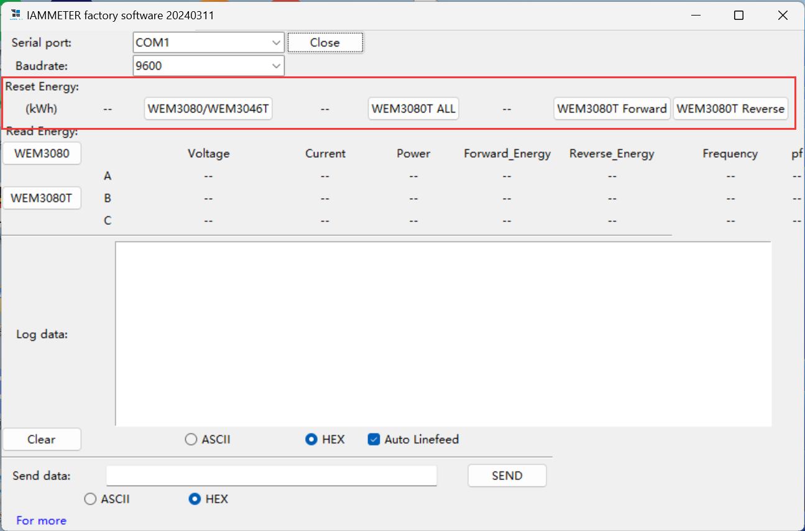
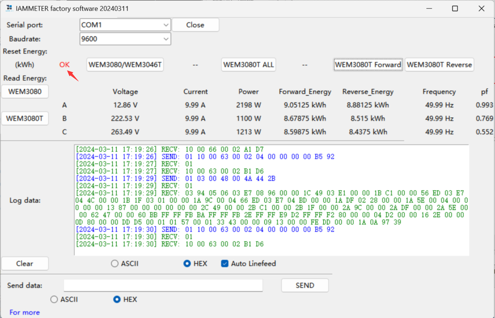
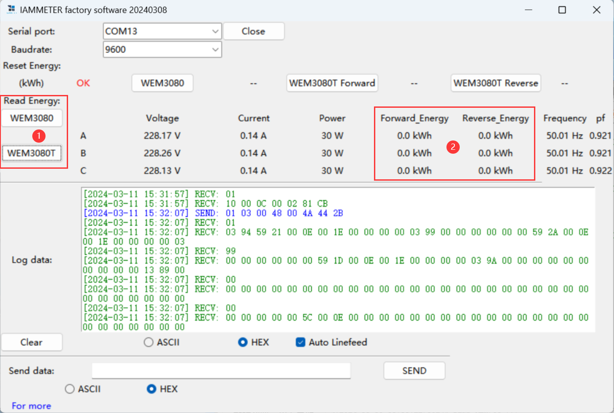

# IAMMETER Factory User Manual

[TOC]

# 1.Hardware connection

Connect the A and B of your USB to 485 to the corresponding A and B of the electric meter. Then power on the electric meter.(USB to 485 tool recommended to use FT232, CH34x, CP2102)

# 2.Software usage

1.Open the software  [iamfact.exe](iamfact.exe) 

2.Select the serial port of your USB to 485 tool and click Open

3.According to your meter model, click the button of the corresponding model to reset the Energy of the meter.

4.After clearing successfully, you will see the "OK" prompt on the left.

5.Of course, you can also read the Energy of the meter through Read Energy to verify whether the reset is successful.

